# 📡 Technical Intelligence Labs | Professional Portfolio

> **"Intelligence is the ability to adapt to change."**

This repository serves as the central hub for **Technical Intelligence Labs**, a professional cybersecurity portfolio and knowledge base. It is designed to demonstrate advanced proficiency in security research, penetration testing, and secure software development.

---

## ⚡ Core Objectives

This project is not just a website; it is an automated **Knowledge Management System (KMS)** designed to streamline the documentation of complex security findings.

*   **Centralized Intelligence**: A unified repository for CTF writeups, vulnerability research, and technical documentation.
*   **Automated Pipeline**: Leveraging **GitHub Actions** and a custom **Python** engine to transform raw Markdown notes into a polished, interactive web experience.
*   **AI-Enriched Reporting**: Integrated with **Google Gemini AI** to automatically refine raw engineering logs into professional-grade executive reports.
*   **Aesthetic Immersion**: A "Security Terminal" UI design featuring CRT simulation, real-time data feeds, and high-fidelity visualizers.

---

## 📂 Architecture & Workflow

The system utilizes a "Docs-as-Code" approach, allowing for seamless content management directly from **Obsidian**.

```mermaid
graph LR
    A[Obsidian Vault] -->|Push| B[GitHub Repo]
    B -->|Trigger| C[GitHub Actions]
    C -->|Build| D[Python Engine]
    D -->|Deploy| E[GitHub Pages]
    
    style A fill:#2e3b4e,stroke:#22d3ee,stroke-width:2px
    style E fill:#0f172a,stroke:#a3e635,stroke-width:2px
```

### Key Components

*   **`content/`**: The Source of Truth. Contains raw Markdown research notes, categorized by domain (Writeups, Projects, Docs).
*   **`manage.py`**: The core logic engine. Handles content parsing, AI enrichment, metadata extraction, and HTML generation.
*   **`css/` & `js/`**: Custom aesthetic definitions using **Tailwind CSS** and vanilla JavaScript for performance and visual fidelity.

---

## 🛡️ Technical Scope

The portfolio showcases work across multiple security domains:

| Domain | Description |
| :--- | :--- |
| **Network Security** | Infrastructure hardening, traffic analysis, and firewall configuration. |
| **Offensive Operations** | CTF walkthroughs (TryHackMe/HackTheBox), exploit development, and red teaming logs. |
| **Secure Development** | Code audits, DevSecOps pipelines, and secure API design. |
| **Threat Intelligence** | OSINT investigations, malware analysis, and incident response playbooks. |

---

## 🔗 Connect

*   **Portfolio**: [kalialucard.github.io](https://kalialucard.github.io)
*   **GitHub**: [@kalialucard](https://github.com/kalialucard)
*   **TryHackMe**: [Top 1% Rank](https://tryhackme.com/p/kalialucard)
*   **HackTheBox**: [Profile](https://app.hackthebox.com/profile/2503089)

---

&copy; 2025 Technical Intelligence Labs. All systems nominal.
