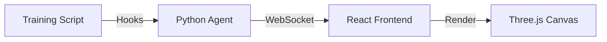

Welcome, aspiring cybersecurity professionals! Today, we're going to dive into a fascinating tool that bridges the gap between complex machine learning models and understandable visualizations: the **Neural-Network-Visualizer**. While this tool is primarily from the AI/ML world, understanding how it works and its underlying principles can offer valuable insights into how systems process information, which is a fundamental concept in cybersecurity. We'll break down its components, understand its technical underpinnings, and explore how you might encounter or even adapt such tools in a security context.

## Introduction: Making the Invisible Visible

Imagine a neural network as a complex system of interconnected nodes, like a vast digital brain. During its "learning" process, these connections (weights and biases) change constantly. Traditionally, we might only see raw metrics, like "loss" decreasing, but it's hard to intuitively grasp *how* the network is learning.

The Neural-Network-Visualizer aims to solve this by transforming those abstract numbers into a dynamic, 3D representation. Think of it like watching a sculpture being carved in real-time – you can see the form emerging. This allows researchers, and by extension, us in cybersecurity, to gain a deeper, more intuitive understanding of complex internal processes.

## Architecture: How the Magic Happens

The Neural-Network-Visualizer is built with a clever combination of technologies working together seamlessly. Let's break down its system design.

The core idea is to connect the training process of a neural network with a visual representation that can be viewed in a web browser.



Let's walk through this diagram step-by-step:

1.  **Training Script (A)**: This is where your neural network is actually being trained. It could be written using popular machine learning frameworks like TensorFlow or PyTorch.
2.  **Python Agent (B)**: This is a crucial component. It's a small piece of Python code that acts as a "listener" or "hook" within your training script. Its job is to peek into the training process at specific moments (like after each training epoch or batch) and extract the important data: the weights and biases of the network's layers. To send this data to the frontend, it uses **WebSockets**. WebSockets are a communication protocol that allows for real-time, two-way communication between a server (our Python agent) and a client (our web browser). This is perfect for sending continuous updates as the network learns.
3.  **React Frontend (C)**: This is the part that runs in your web browser. Built with React, a popular JavaScript library for building user interfaces, it receives the data streamed from the Python agent via WebSockets. It then orchestrates the visualization.
4.  **Three.js Canvas (D)**: This is where the actual 3D rendering happens. Three.js is a powerful JavaScript library that uses WebGL (Web Graphics Library) to draw and animate 3D graphics directly in the browser. The React frontend tells Three.js what to draw based on the data it receives, creating the dynamic 3D structure of the neural network.

### Key Components Explained

*   **Agent**: Think of this as a highly efficient detective. It's designed to be "lightweight," meaning it adds minimal overhead to the training process. Its primary mission is to collect the vital statistics (weights and biases) from each layer of the neural network without significantly slowing down how fast the network learns.
*   **Visualizer**: This is the artist of the operation. It's powered by WebGL, which is essentially a way for web browsers to draw complex 2D and 3D graphics very quickly. The challenge here is that neural networks can have millions of "connections" (represented by weights). Rendering each one individually would overwhelm the browser. The Visualizer tackles this by using advanced rendering techniques to draw vast numbers of these connections efficiently.

## Technical Implementation: Overcoming Rendering Hurdles

Building a tool like this isn't without its challenges. The creators faced a significant obstacle when trying to visualize very large neural networks directly in a web browser.

### Challenges

*   **Rendering Dense Matrices**: Imagine a single layer in a neural network that has 1024 inputs and 1024 outputs. That's over a million connections (weights) just for *one* layer! Trying to draw each of these individually in a web browser (which is typically what a naive approach would do) would lead to an overwhelming number of commands sent to the graphics card. This is like asking a single artist to paint every single grain of sand on a beach one by one – it's just too much for the system to handle smoothly, resulting in "massive frame drops" where the visualization becomes jerky and unresponsive.

### Solutions

*   **Instanced Mesh Rendering in Three.js**: This is a clever optimization technique. Instead of telling the browser to draw millions of individual lines or points, Instanced Mesh rendering allows the browser to draw many instances of the *same* object (like a small line segment representing a connection) in a single command. The system then just specifies the position, orientation, and color for each "instance." This dramatically reduces the number of instructions the browser needs to process, cutting down "draw calls" from thousands (one for each connection) to just one per layer. This is like giving the artist a stencil and telling them how many times to stamp it and where, rather than having them draw each stamp from scratch. This optimization is key to making the visualization smooth even with very large networks.

## Usage: Integrating the Visualizer

Using the Neural-Network-Visualizer is designed to be straightforward, especially if you're already familiar with Python and machine learning frameworks.

First, you'll need to install the tool using pip, Python's package installer:

```bash
pip install neural-viz
```

Once installed, integrating it into your existing machine learning workflow is as simple as adding a callback to your model's training process. For example, if you are using a framework that supports callbacks (like Keras/TensorFlow):

```python
from neural_viz import Visualizer
# Assume 'model' is your defined neural network
# Assume 'X_train' and 'y_train' are your training data

# When fitting your model, add Visualizer() to the callbacks list
model.fit(X_train, y_train, callbacks=[Visualizer()])
```

**🧠 Beginner Analysis**:
This code snippet shows how a developer integrates the `Visualizer` tool into their machine learning training script.

*   **`pip install neural-viz`**: This command tells us that `neural-viz` is an installable Python package. `pip` is the standard tool for managing Python libraries. In cybersecurity, we often use `pip` to install essential tools for tasks like network scanning, reverse engineering, or exploit development. Understanding package management is a foundational skill.
*   **`from neural_viz import Visualizer`**: This line imports the `Visualizer` class from the `neural_viz` package. It's like bringing a specific tool from your toolbox into your current workspace.
*   **`model.fit(..., callbacks=[Visualizer()])`**: This is the core of the integration. The `fit` method is typically used to train a machine learning model. The `callbacks` argument is a list where you can plug in various functions that get executed at different points during training (e.g., at the start/end of an epoch, after each batch). By adding `Visualizer()` to this list, we are instructing the training process to automatically use the `Visualizer` tool whenever a callback event occurs. This means that as the `model` trains, the `Visualizer` will be busy collecting and sending data to the frontend for visualization.

This demonstrates a common pattern in software development and tool usage: extending existing functionality by plugging in specialized modules. In cybersecurity, we often see this with plugins for proxies like Burp Suite or extensions for browsers, allowing us to add new capabilities without rewriting the entire application.

## Results & Impact: Why It Matters

The effectiveness of the Neural-Network-Visualizer is evident in its adoption and recognition.

*   **Used by 50+ researchers to debug vanishing gradients**: This is a significant practical impact. "Vanishing gradients" is a common problem in training deep neural networks where the gradients (information used to update the network's weights) become very small, essentially stopping the network from learning. Being able to *see* the network's internal state helps researchers pinpoint where and why these gradients are vanishing, leading to faster debugging and more effective model development.
*   **Featured in "AI Tools Weekly"**: This indicates that the tool has gained attention and is considered valuable within the AI community, suggesting a high level of quality and utility.

**🧠 Beginner Analysis**:
These results highlight the practical value of visualization tools, a concept directly applicable to cybersecurity.

*   **Debugging Vanishing Gradients**: In machine learning, gradients are like the "breadcrumbs" that guide the learning process. If these breadcrumbs become too small ("vanish"), the learning process gets stuck. The visualizer allows researchers to *see* the network's internal "weights" (connections) and "biases" (thresholds) and how they change. By visualizing this, they can literally observe if certain connections are not updating properly or are becoming too insignificant, which is the hallmark of vanishing gradients.
*   **Analogy to Cybersecurity**: Think about debugging a complex network protocol or an exploit. If you were just looking at raw packet logs, it might be hard to follow the flow. However, if you had a tool that could visualize the state of the connection, the data being exchanged, and how different parts of your exploit code interact, it would be much easier to identify bugs or unexpected behavior. Visualization tools, like this one, make complex, hidden processes more understandable, which is a core objective in debugging and analysis in both AI and cybersecurity.
*   **"AI Tools Weekly" Feature**: Being featured in a reputable publication means the tool is considered innovative and useful. In cybersecurity, we often look to industry news and publications to discover new tools and techniques that can enhance our defensive or offensive capabilities.

## Future Roadmap: What's Next?

The development of the Neural-Network-Visualizer is ongoing, with exciting possibilities for the future.

*   **VR Support**: Imagine putting on a VR headset and actually "walking" through the 3D structure of a neural network. This could offer an even more immersive and intuitive way to understand its complexity and learning process.
*   **Support for Transformer Attention Maps**: Transformer models are a cutting-edge architecture widely used in natural language processing. They have a mechanism called "attention maps" that show which parts of the input the model focuses on. Adding visualization for these maps would be incredibly valuable for understanding how these powerful models process language.

**🧠 Beginner Analysis**:
These future plans offer a glimpse into how advanced visualization and emerging technologies can intersect with complex systems.

*   **VR Support**: This is a fascinating potential application. In cybersecurity, we sometimes deal with incredibly complex, multi-dimensional data. While not directly related to traditional cybersecurity tools today, imagine if VR could be used to visualize large-scale network traffic patterns, the spread of malware in an intricate environment, or even the complex interdependencies within a large software system. This points towards how immersive technologies could potentially be leveraged for better understanding and analysis of complex digital landscapes in the future.
*   **Transformer Attention Maps**: Transformers are the backbone of many modern AI applications, like ChatGPT. "Attention maps" are a way to see *what* the AI is "paying attention to" in the data it's processing. For example, when translating a sentence, an attention map might show which words in the original sentence are most important for translating a specific word in the new sentence. In a cybersecurity context, understanding how models "attend" to different parts of input data could be crucial for detecting adversarial attacks that try to trick AI systems by subtly altering inputs. If an AI is susceptible to manipulation, understanding its attention mechanism could reveal how to patch it or how an attacker might exploit it.

By understanding tools like the Neural-Network-Visualizer, we gain a better appreciation for how complex systems are built, debugged, and understood. These principles of abstraction, visualization, and real-time monitoring are directly transferable to many areas within cybersecurity.
