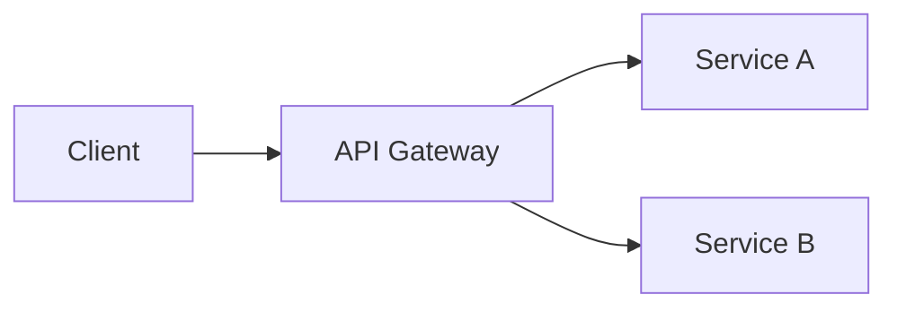

# Project Name

> **Status**: Completed / Active  
> **Type**: Research / Tooling / Architecture

## Overview
A detailed description of the project. What problem does it solve? Why was it built?

## Architecture
### System Design
High-level architecture diagram or description.



### key Components
*   **Core Engine**: Handles X and Y logic.
*   **Interface**: CLI/Web interface built with Z.

## Technical Implementation
### Challenges
Discuss specific technical challenges faced (e.g., optimization, concurrency, security).

### Solutions
How were those challenges solved?

## Usage
```bash
git clone https://github.com/kalialucard/project-repo
cd project-repo
pip install -r requirements.txt
python main.py
```

## Results & Impact
*   Improved processing speed by 40%.
*   Automated manual workflow X.

## Future Roadmap
*   [ ] Add GUI
*   [ ] Support Cloud deployment
