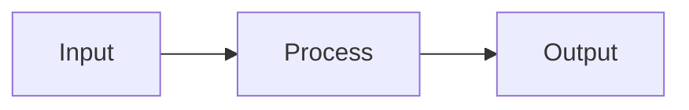

# Project Name

> **Status**: Completed / Active
> **Type**: Tool / Research

## Overview
What is this project? What problem does it solve?

## Architecture
### Design
How does it work?



## Usage
```bash
git clone ...
```

## Results
What did you achieve?
